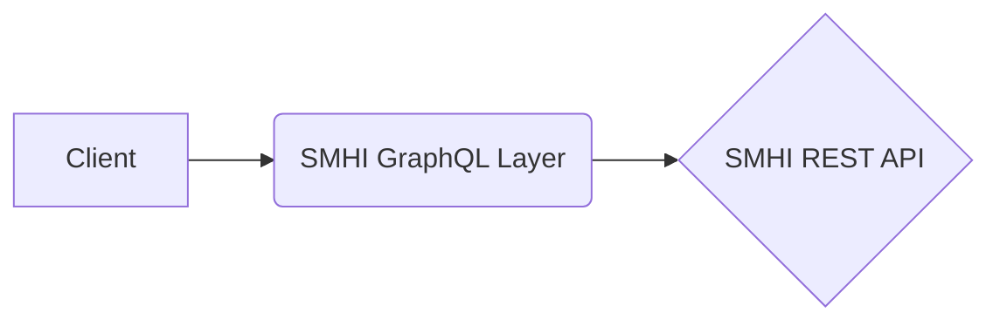

# SMHI GraphQL API (Unofficial)

## Motivation

This GraphQL API documents the Swedish Meteorological and Hydrological Institutes sea observations from multiple buoys surrounding the _Baltic Sea_, _Kattegat Strait_ and _Skagerrak strait_.

At the time of publishing, there wasn't an Open Graphql API for the data provided by SMHI.

Current Data Available:
| Station | Wave Height (m) | Sea Temperature (°C) | Wave Period Max (s) | Wave Direction (°) | Wave Period Average (s) | Wave Height Max (m)|
|--|--|--|--|--|--|--|
| Knolls Grund|✅ |✅ |✅ |✅ |✅ |✅ |
|Huvudskär Ost|✅ |❌|✅ |✅ |❌ |✅ |
| Finngrundet WR|✅ |✅ |✅ |✅ |✅ |✅ |
| Väderöarna WR|✅ |✅ |✅ |✅ |✅ |✅ |

## Usage

The queries are made with two parameters:

- **stationId** - represents the station (see **Stations**)
- **parameter** - represents the field to request (see **Parameters**)

